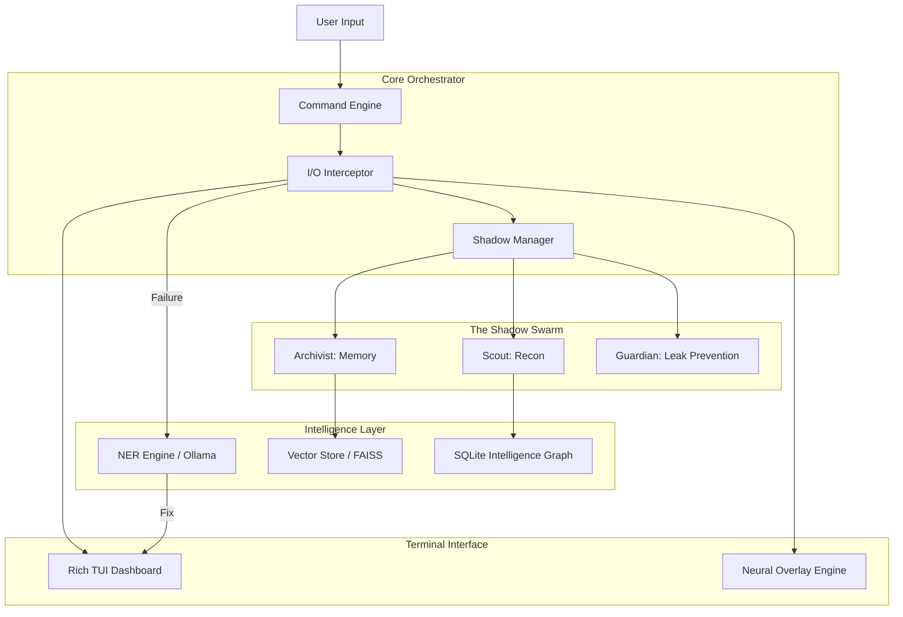

# 🌌 VOID-SHELL: THE DARK MATTER PROTOCOL

<p align="center">
  
</p>

<p align="center">
  <a href="https://github.com/DXN1-termux/VOID-SHELL/stargazers"></a>
  <a href="https://github.com/DXN1-termux/VOID-SHELL/network/members"></a>
  <a href="https://github.com/DXN1-termux/VOID-SHELL/actions"></a>
  <a href="https://github.com/DXN1-termux/VOID-SHELL/issues"></a>
  <a href="https://github.com/DXN1-termux/VOID-SHELL/blob/master/LICENSE"></a>
</p>

---

## 🏛 PHILOSOPHY

**VOID-SHELL** is the synthesis of human intent and machine intelligence. It is a **Neural OS Overlay** that transforms the traditional terminal from a static input-output stream into a dynamic, self-evolving intelligence ecosystem. 

In the modern landscape of high-stakes security research and complex software engineering, the bottleneck is no longer the machine—it is the cognitive load on the operator. `VOID-SHELL` exists to bridge this gap, acting as a "Ghost in the Machine" that predicts, heals, and augments every keystroke.

> *"The terminal is the last frontier of pure human-machine interaction. VOID-SHELL ensures that frontier is powered by Dark Matter."*

---

## 🔱 CORE PROTOCOLS

### 1. NER (Neural Error Reconstruction)
Standard shells treat an exit code `> 0` as a failure. `VOID-SHELL` treats it as a **Contextual Query**. 
- **The Interceptor:** Captures the exact state of the environment (variables, previous commands, system load) at the moment of failure.
- **The Reconstructor:** Synthesizes a semantic patch. It doesn't just suggest a fix; it explains the logic behind the failure using local-first LLM inference (Ollama/Qwen).

### 2. THE SHADOW SWARM (Autonomous Background Intelligence)
Behind every command, a swarm of non-blocking workers is dispatched.
- **Scout Worker:** Passive reconnaissance. If you `curl` a domain, the Scout is already mapping its subdomains and headers in the background.
- **Archivist Worker:** Real-time semantic indexing. Every output is converted into a vector and stored in a local FAISS database, allowing you to query your own terminal history via natural language.
- **Guardian Worker:** Leak prevention. It monitors stdout for leaked private keys, credentials, or PII and obfuscates them in real-time.

### 3. HYPER-REACTIVE NEURAL OVERLAYS
The terminal output is augmented with a live intelligence layer.
- **Entity Recognition:** IPs are checked against threat-intel feeds.
- **Credential Analysis:** Highlighting entropy and potential security risks in tokens or passwords.
- **Structural Highlighting:** SQL queries, JSON objects, and complex logs are beautified and semantically color-coded.

---

## 🏗 TECHNICAL ARCHITECTURE

`VOID-SHELL` is built on a modular, asynchronous foundation designed for maximum performance in resource-constrained environments like Termux.



### Deep Dive: Memory Layer
The memory layer uses a hybrid approach:
1. **LTM (Long Term Memory):** An SQLite database tracking every target, port, and vulnerability found across sessions.
2. **STM (Short Term Memory):** An in-memory vector store for the current session's output, enabling instant "Recall" commands.

---

## 🛠 INSTALLATION & DEPLOYMENT

### Prerequisites
- **Python:** 3.10.x or higher
- **System:** Termux (Android), Arch Linux, macOS, or Ubuntu
- **LLM Core:** Ollama (Default: `qwen2.5-coder:0.5b` for speed, `llama3:8b` for IQ)

### Elite Installation
```bash
# Clone the protocol
git clone https://github.com/DXN1-termux/VOID-SHELL.git
cd void-shell

# Initialize the modular environment
python3 -m venv venv
source venv/bin/activate

# Install the high-speed dependencies
pip install -r requirements.txt

# Bootstrap the configuration
cp .env.example .env
python3 setup.py --init
```

### Shell Integration
Inject `VOID-SHELL` into your environment:
```bash
# For Bash
echo "alias v='python3 -m void_shell.main'" >> ~/.bashrc
source ~/.bashrc

# For Zsh
echo "alias v='python3 -m void_shell.main'" >> ~/.zshrc
source ~/.zshrc
```

---

## ⚙️ ADVANCED CONFIGURATION

`VOID-SHELL` is highly tunable via the `config.json` file.

```json
{
  "system": {
    "log_level": "DEBUG",
    "stealth_mode": false,
    "max_parallel_workers": 8
  },
  "ai": {
    "provider": "ollama",
    "endpoint": "http://localhost:11434/api/generate",
    "model": "qwen2.5-coder:0.5b",
    "temperature": 0.2,
    "max_tokens": 1024
  },
  "memory": {
    "vector_store": "faiss",
    "persist_path": "./data/memory.db",
    "auto_index": true
  },
  "tui": {
    "theme": "dark_matter",
    "show_shadow_status": true,
    "compact_mode": false
  }
}
```

---

## 📖 USAGE GUIDE

### Basic Command Wrapping
Simply prefix any command with `v`:
```bash
v nmap -p- 192.168.1.1
```
The UI will split, showing the command output in the main panel and the **Shadow Swarm** status in a side panel.

### Neural Recall
Query your session history semantically:
```bash
v recall "What was the SSH version on the target I scanned earlier?"
```

### Self-Correction Trigger
If you run a broken script:
```bash
v python3 broken_exploit.py
```
`VOID-SHELL` will automatically catch the traceback, explain it, and offer to `PATCH & RE-RUN`.

---

## 🗺 ROADMAP: THE EVOLUTION

- [ ] **Phase 1: Foundation** (Current) - Modular engine, basic AI fixes, TUI.
- [ ] **Phase 2: Synapse** - Full vector memory integration, P2P intelligence sharing.
- [ ] **Phase 3: Singularity** - Autonomous payload generation, recursive exploit loops.
- [ ] **Phase 4: Void-Access** - Web-based dashboard and remote shell orchestration.

---

## 🤝 CONTRIBUTING TO THE ABYSS

We are looking for elite developers to expand the **Shadow Swarm**. 
1. **Fork** the protocol.
2. Implement a new **Worker** in `void_shell/shadow/workers/`.
3. Submit a **PR** with detailed technical rationale.

---

## 📜 LICENSE
Licensed under the **MIT Elite License**. See `LICENSE` for details.

<p align="center">
  <i>"In the silence of the void, the machine speaks."</i>
</p>
