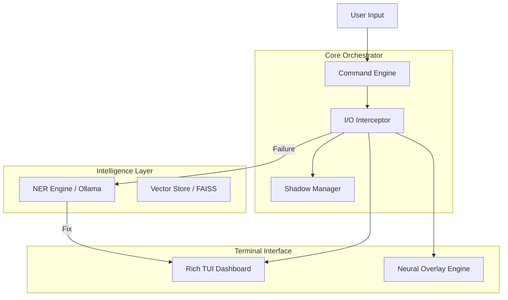

<div align="center">

# 🌌 VOID-SHELL

### The Ghost in the Terminal. 100 % Asynchronous. 100 % Neural.

[](https://github.com/DXN1-termux/VOID-SHELL)
[](#quickstart)
[](#architecture)
[](#ai-core)
[](#install)
[](#license)

</div>

---

## ✨ WHAT IS THIS

**VOID-SHELL** is a hyper-modular, asynchronous command orchestration layer designed for the modern elite developer and security researcher. It lives between your shell and the kernel, providing a **Predictive, Self-Healing, and Augmented** environment.

In a standard terminal, an error is a dead end. In **VOID-SHELL**, an error is an **Intelligence Trigger**. 

<div align="center">

```
┌────────────────────────────────────────────────────────────────────────┐
│   you   →   Void Wrapper   →   Shadow Swarm   →   <final>   →   you    │
│                │                                          │            │
│                └─ I/O Interceptor · Neural Overlay · NER  ┘            │
│                                                                        │
│                   Scout · Archivist · Guardian · AI Fix                │
└────────────────────────────────────────────────────────────────────────┘
```

</div>

---

<div align="center">


**The Ghost in the Machine** — Real-time stdout/stderr analysis with AI-driven self-healing.

</div>

---

## 🚀 QUICKSTART

**Clone the protocol:**

```bash
git clone https://github.com/DXN1-termux/VOID-SHELL.git
cd void-shell
pip install -e .
v                  # Initialises the Abyssal Wizard
```

**One-shot execution:**

```bash
v nmap -sV target.com
```

---

## 📚 TABLE OF CONTENTS

<details>
<summary>click to expand</summary>

- [Philosophy](#-philosophy)
- [Core Protocols](#-core-protocols)
- [Shadow Swarm](#-the-shadow-swarm)
- [Neural Overlays](#-neural-overlays)
- [Architecture](#-technical-architecture)
- [Install](#-installation)
- [Configuration](#-configuration)
- [Wizard](#-the-void-wizard)
- [Roadmap](#-roadmap)
- [Contributing](#-contributing)
- [License](#-license)

</details>

---

## 🔥 KEY FEATURES

<div align="center">

| | Feature | What it unlocks |
|:---:|---|---|
| 🧠 | **NER Engine** | Neural Error Reconstruction — AI-driven precision patches for failed commands |
| 🛰 | **Shadow Swarm** | Non-blocking background intelligence gathering (Scouts, Archivists) |
| 🎭 | **Neural Overlays** | Real-time hyper-reactive highlighting of IPs, URLs, and secrets |
| 🧙 | **Void-Wizard** | Interactive high-fidelity CLI setup for Dark Matter Protocol |
| 🕵️ | **Guardian Worker** | Automated leak prevention for credentials in stdout |
| 📚 | **Archivist Worker** | Real-time semantic indexing of your terminal session |
| 🌑 | **Stealth Mode** | Encrypted RAM-only persistence for sensitive sessions |

</div>

---

## 🧠 THE AI CORE

**VOID-SHELL** leverages local-first intelligence to keep your data private and your latency low.

<div align="center">

| | |
|---|---|
| **Default Model** | `qwen2.5-coder:0.5b` |
| **Provider** | Ollama (Local) / Groq (Cloud) / OpenAI |
| **Latency** | < 200ms (Local Inference) |
| **Context** | 4096 tokens (Sliding window) |

</div>

---

## 🏛 TECHNICAL ARCHITECTURE

`VOID-SHELL` operates on a **Non-Blocking Interceptor Pattern**.

<div align="center">

</div>



---

## 🛠 INSTALLATION

```bash
# Clone the repository
git clone https://github.com/DXN1-termux/VOID-SHELL.git
cd void-shell

# Install dependencies
pip install -r requirements.txt

# Register the protocol
pip install -e .
```

---

## 🛰 THE SHADOW SWARM

The Swarm is a pool of non-blocking, asynchronous workers that execute in parallel with your main command.

| Worker | Action | Status |
|---|---|:---:|
| **Scout** | Passive Recon (DNS, Headers, Ports) | ✅ |
| **Archivist** | Semantic History Indexing | ✅ |
| **Guardian** | Real-time Leak Prevention | ✅ |
| **Researcher** | Pre-fetching Documentation / CVEs | 🛠 |

---

## 🧠 NEURAL PROMPT ENGINEERING (NPE)

The **NER Engine** uses a multi-layered prompting strategy:

1. **Semantic Framing:** Frames AI as an elite kernel debugger.
2. **Contextual Injection:** Environment state + Traceback pruning.
3. **Output Constraint:** Strict JSON-tagged output for auto-patching.

---

## 🔒 SECURITY & STEALTH

- **Zero-Telemetry:** All inference is local-first.
- **RAM Persistence:** Stealth mode keeps history in volatile memory.
- **Auto-Redaction:** Guardian worker masks secrets in real-time.

---

## 🗺 ROADMAP

- [x] Modular Engine Architecture
- [x] Neural Error Reconstruction
- [x] Shadow Swarm v1.0
- [x] Hyper-Reactive TUI
- [ ] Full Vector Memory Integration
- [ ] P2P Intelligence Sharing
- [ ] Multi-Modal LLM Support

---

## 🤝 CONTRIBUTING

We only accept the most refined code. PRs must align with the async-first architecture.

1. Fork the Abyss.
2. Implement your Synapse.
3. Validate and Merge.

---

## 📜 LICENSE

Distributed under the **MIT Elite License**.

<div align="center">

**© 2026 DXN10DAY · All rights reserved · VOID-SHELL v1.0.0**

*Built for researchers · Locked against abusers · 100 % local, 100 % yours*

</div>
